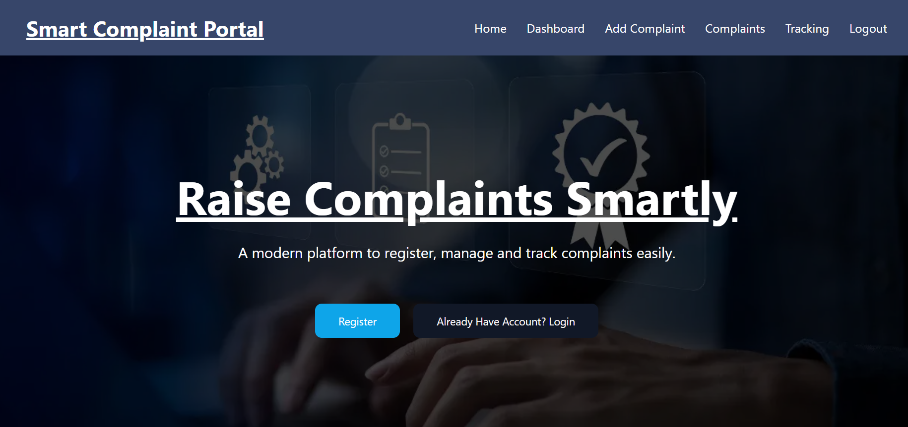
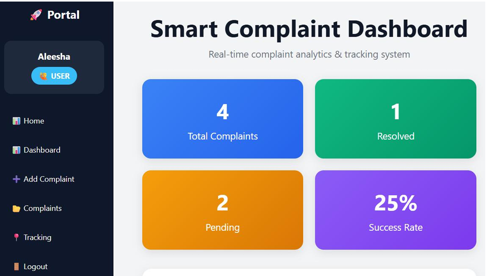
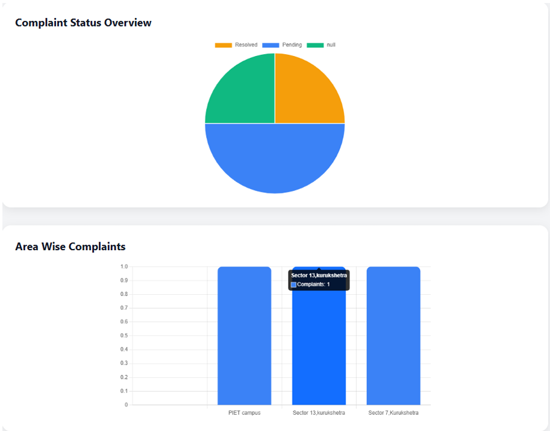
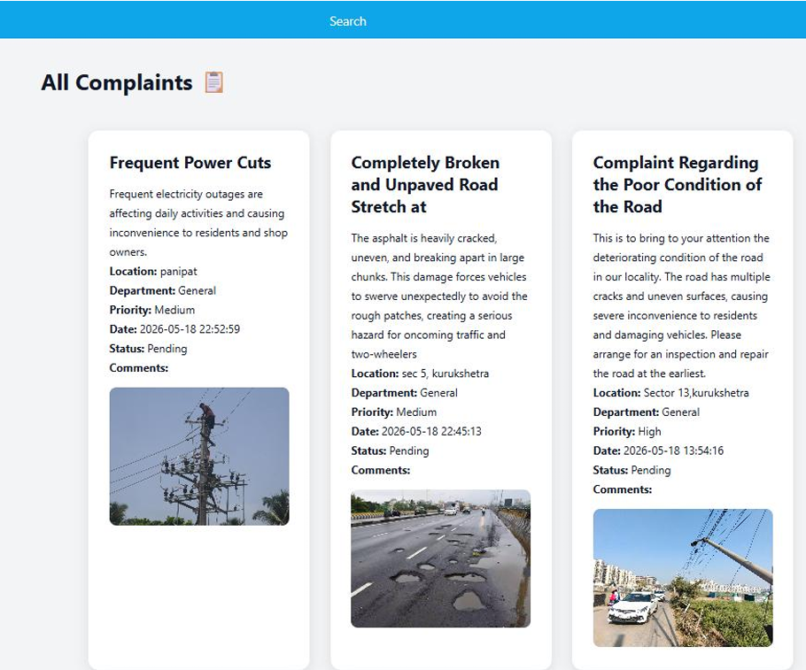

# 📝 Complaint Portal

A web-based Complaint Management System developed using PHP and MySQL that allows users to register complaints, track their status, and enables administrators to efficiently manage and resolve complaints through a dedicated dashboard.

---

## 🚀 Features

### 👤 User Features

- User Registration & Login
- Secure Authentication
- Submit Complaints
- Track Complaint Status
- View Complaint History
- Upload Complaint Related Files

### 🛠️ Admin Features

- Admin Dashboard
- Manage Users
- View All Complaints
- Update Complaint Status
- Filter Complaints
- Complaint Resolution Management

---

## 💻 Tech Stack

### Frontend

- HTML5
- CSS3
- JavaScript

### Backend

- PHP

### Database

- MySQL

### Server

- XAMPP

### Version Control

- Git
- GitHub

---

## 📂 Project Structure

```text
complaintportal/
│
├── admin/
├── uploads/
├── Screenshots/
│
├── add_complaint.php
├── complaints.php
├── dashboard.php
├── db.php
├── filter.php
├── index.php
├── login.php
├── logout.php
├── register.php
├── sidebar.php
├── style.css
├── track.php
└── database_complaintportal.sql
```

---

## ⚙️ Installation Guide

### Step 1

Clone the repository

```bash
git clone https://github.com/Aleesha-16/Complaint-Portal.git
```

### Step 2

Move the project folder into:

```text
xampp/htdocs/
```

### Step 3

Start:

- Apache
- MySQL

from XAMPP Control Panel.

### Step 4

Import database:

```text
database_complaintportal.sql
```

into phpMyAdmin.

### Step 5

Open browser:

```text
http://localhost/complaintportal
```

---

## 📸 Project Screenshots

### Login / Home Page



### Complaint Dashboard



### Complaint Management



### Admin Dashboard



---

## 🎯 Future Improvements

- Email Notifications
- Complaint Priority System
- SMS Alerts
- Analytics Dashboard
- Mobile Responsive UI
- Cloud Deployment

---

## 👩‍💻 Author

### Aleesha

B.Tech Information Technology Student

Panipat Institute of Engineering & Technology (PIET)

Aspiring Software Engineer | Full Stack Developer | AI Enthusiast

---

## ⭐ Support

If you found this project useful, consider giving it a ⭐ on GitHub.
